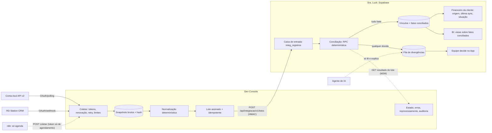

# Conta Azul e RD Station via Dev Console — proposta de desenho (28/09/2026)

**Estado: PROPOSTA para aprovação. Nenhum código de sincronização foi escrito.**
Substitui, quando aprovada, o trecho "Segredos só no cofre cifrado (`integracoes_credenciais`),
editados no Admin" de `docs/INTEGRACOES-MAPA.md` §4.

Regra de arquitetura (decisão do responsável, 28/09): toda conexão externa é administrada só pelo
Dev Console — credenciais OAuth, renovação de tokens, configuração, estado, erros e reprocessamento.
O App não tem tela de conexão nem guarda credencial desses serviços. O Console entrega ao Sra. Luck
somente dados normalizados, por integração autenticada. O App continua dono das regras da jornada e
da exibição das parcelas; o BI consome apenas registros validados, com vínculo até a origem.

---

## 1. Inventário do que existe hoje

### 1.1 Parcelas, pagamentos e comprovantes (App + Supabase)

| Objeto | Onde | Papel hoje | Produção (28/09) |
|---|---|---|---|
| Contrato | `clientes.valor_contrato`, `taxa_administrativa_percentual`, `custo_total` (gerado), `quantidade_parcelas`, campos `*_plano` | valor da carta, taxa e plano | 3 clientes |
| Parcela prevista | `boletos` (`numero_parcela`, `total_parcelas`, `valor`, `data_vencimento`, `status` nao_pago/pendente_confirmacao/pago/rejeitado, `suspensa`, `carne_id`, `origem_boleto`) | parcela do Sra. Luck | 84 (75 abertas, 8 pagas, 1 em conferência) |
| Carnê | `carnes`, `carne_importacoes`, leitor (`worker/admin-carne-leitor.ts`, RPC `carne_importar_parcelas`) | parcelas lidas do PDF do banco | 0 vinculados |
| Pagamento confirmado | `financeiro_recebimentos` (ledger: `valor_original`, `juros`, `multa`, `desconto`, `valor_recebido`, `data_pagamento`, `forma_pagamento`, `origem` manual/comprovante/historico/banco/mercado_pago/conta_azul, `status_validacao`, `validado_por/em`, `idempotency_key` único) | fonte do "pago" | 8 validados, 2 rejeitados, todos manuais |
| Comprovante | Storage privado `boletos-clientes` + `boletos.comprovante_url`; validação `financeiro_validar_comprovante` | evidência anexada pela cliente | 1 em conferência |
| Baixa manual | RPC `financeiro_baixar_boleto` (idempotente por chave) | equipe com `financeiro.baixa_manual` | — |
| Conciliação bancária | `conciliacao_pagamentos` (+ histórico), `pagamentos_externos` | previstas para bancos/Mercado Pago | 0 linhas |
| Edição de vencimento/valor | `worker/admin-parcelas.ts` (UPDATE + `logs_alteracoes` `editou_parcela` com `de`/`para`) | histórico só em JSON de auditoria | — |

Rotas: `GET /api/cliente/boletos`, `POST /api/cliente/boletos/:id/anexar`, `/api/admin/financeiro/*`
(recebíveis, baixa, validações confirmar/rejeitar, conciliação, resumo), `/api/admin/clientes/:id/parcelas`,
`/api/admin/boletos*`, `/api/admin/clientes/:id/leitor-carne*`.

### 1.2 Conta Azul — hoje dentro do App (contraria a regra nova)

- `worker/conta-azul.ts` (931 linhas): OAuth no App (`/api/integrations/conta-azul/oauth/callback`),
  tokens cifrados em `integracoes_credenciais` (cofre do App), fila `integracao_fila`, conflitos
  `integracao_conflitos`, vínculos `conta_azul_vinculos` (`boleto_id`, `marcador` SLK-…,
  `ca_evento_id`, `ca_parcela_id`, `ca_versao`, snapshots), rotas `/api/admin/integrations/conta-azul/*`
  (painel, sincronizar, enviar-cliente, vincular, resolver conflito, reprocessar fila).
- Escreve na Conta Azul (cria contas a receber, PATCH, baixa, estorno).
- **Produção: nunca conectada** — 0 credenciais, 0 vínculos, 0 fila, 0 conflitos.

### 1.3 RD Station — hoje dentro do App (contraria a regra nova)

- `worker/rd-station-readonly.ts`, `worker/crm-importacao.ts`: OAuth e webhook no App, importação por
  RDQL para `novas_vendas`, deduplicação por CPF/telefone/e-mail, revisão "importar mesmo assim".
- Cron `integracoes-sync-15min` (pg_cron → `POST /api/cron/integracoes` do App).
- **Produção:** 7 credenciais RD no cofre do App; 119 importações agendadas com **75 em erro**;
  2.915 entradas `crm_vendas_entrada` aguardando conferência; 1.208 `novas_vendas` aguardando cadastro.
- A vendedora chega como **texto** (`vendedora_responsavel`); `novas_vendas.rd_owner_id` existe, mas
  **não há mapeamento para `colaboradores`** (0 clientes com `vendedora_id`). SDR não é importado.

### 1.4 Riscos encontrados no inventário

1. Credenciais de terceiros no App (cofre `integracoes_credenciais`) — sai do App na migração.
2. Vendedora por nome, sem identificador estável — comissão e indicadores por vendedora não são confiáveis hoje.
3. Edição de parcela grava alteração e auditoria em duas escritas (mesmo padrão corrigido no
   levantamento pela migration_112) — corrigir antes de usar vencimento alterado no BI.
4. Histórico de vencimento só existe como JSON em `logs_alteracoes` — o BI precisa de histórico estruturado.

---

## 2. Fonte de verdade por informação

| Informação | Fonte de verdade | Conta Azul / RD | Divergência vira |
|---|---|---|---|
| Venda comercial (negociação, vendedora, SDR, origem) | **RD Station** até o cadastro; depois o Sra. Luck | RD é lido, nunca escrito | fila de registros incompletos |
| Cliente e contrato (valor da carta, taxa, nº de parcelas) | **Sra. Luck** (`clientes`, plano/carnê) | CA espelha | divergência `CONTRATO_DIVERGENTE` |
| Parcela prevista (número, valor) | **Sra. Luck** (`boletos`) | CA espelha | `VALOR_DIVERGENTE` |
| Vencimento vigente | **Sra. Luck** (alteração com auditoria) | CA espelha | `VENCIMENTO_DIVERGENTE` |
| Pagamento confirmado (a parcela está paga) | **Sra. Luck** (`financeiro_recebimentos` validado por pessoa) | a baixa da CA é **evidência**, não decisão | `PAGO_NA_CA_AGUARDANDO_BAIXA` |
| Data e valor efetivamente recebidos (BI) | **baixa da Conta Azul conciliada** com a parcela do Sra. Luck | — | fica fora do BI até conciliar |
| Comprovante | **Sra. Luck** (Storage privado) | anexo da CA é só referência | — |
| Identidade da cliente na CA | vínculo persistente `clientes.id` ↔ pessoa CA, confirmado por CPF exato | — | `CLIENTE_DIVERGENTE` |

Nunca se vincula por nome ou valor parecido. Chaves aceitas: IDs persistentes (`boleto.id` ↔
`ca_parcela_id`; `clientes.id` ↔ `ca_pessoa_id`; `novas_vendas.rd_station_id`; `colaboradores.id` ↔
`rd_user_id`). CPF só **confirma** um vínculo, nunca cria sozinho.

---

## 3. Fluxo proposto



Por que a conciliação fica no banco do App e não no Console: ela precisa das parcelas, do ledger e
dos vínculos do Sra. Luck na **mesma transação** (sem corrida entre dois bancos) e precisa ser a
**única implementação autoritativa** (AGENTS.md §4). O Console continua fazendo tudo o que é
conexão e entrega apenas registros normalizados; o App só aceita dados que passaram pela conciliação.
**Ponto a confirmar:** se preferir a conciliação dentro do Console, o contrato de dados muda (o
Console passa a ler parcelas via M2M e o App recebe só resultados); o restante do desenho vale igual.

Escrita na Conta Azul (criar conta a receber, baixa, estorno) fica **fora desta etapa**. Quando
entrar, será o Console executando um pedido explícito do App, com a mesma fila e auditoria.

---

## 4. Contratos de dados

### 4.1 Console → App: entrega de lote

`POST /api/integracao/v1/lotes` — rota nova, fora de `/api/admin/*`, só para o Console.

- Autenticação: `Authorization: Bearer <INTEGRACAO_INGEST_TOKEN>` (≠ token M2M do Admin) **e**
  `x-sra-assinatura: sha256=HMAC(segredo, timestamp + "." + corpo)` com `x-sra-timestamp`
  (janela de 5 min). Sem os dois, 401 antes de ler o corpo.
- Idempotência: `lote_id` único. Reenvio do mesmo lote devolve o mesmo resultado e não grava nada.
- Limite: 500 registros ou 1 MB por lote.

```json
{
  "versao_contrato": 1,
  "provedor": "conta_azul",
  "lote_id": "ca-2026-09-28T12:00:00Z-7f3a",
  "origem": "agendada | manual | reprocessamento",
  "ator": "console:user:<id> | console:agendador | n8n:<fluxo>",
  "coletado_em": "2026-09-28T12:00:04Z",
  "janela": { "de": "2026-09-28T11:45:00Z", "ate": "2026-09-28T12:00:00Z" },
  "registros": [ { "tipo": "ca_parcela", "...": "ver 4.2" } ]
}
```

Resposta: `{ lote_id, recebidos, novos, inalterados, conciliados, divergencias_abertas, rejeitados:[{indice, motivo}] }`.

### 4.2 Registros normalizados

**`ca_parcela`** (Conta Azul, uma por parcela; valores em centavos inteiros; datas civis de São Paulo)

| Campo | Origem na API v2 | Obrigatório |
|---|---|---|
| `id_externo` | `parcela.id` | sim |
| `versao` | `parcela.versao` | sim |
| `evento_id` | `parcela.evento.id` | sim |
| `pessoa_id` | cliente do evento | sim |
| `pessoa_documento` | CPF da pessoa (só dígitos) | sim (confirmação) |
| `marcador` | `SLK-…` extraído de descrição/nota | não |
| `numero` / `total` | parcela/total do evento | não |
| `valor_bruto_centavos` | `valor_composicao.valor_bruto` | sim |
| `vencimento` | `data_vencimento` | sim |
| `status` | `status` (PENDENTE, ATRASADO, QUITADO, RECEBIDO_PARCIAL, CANCELADO, RENEGOCIADO, PERDIDO) | sim |
| `baixas[]` | `baixas`: `id`, `data_pagamento`, `principal_centavos`, `juros`, `multa`, `desconto`, `taxa`, `metodo`, `conta_financeira_id` | sim (pode ser vazio) |
| `alterado_em` | `data_alteracao` | sim |
| `hash` | SHA-256 do registro normalizado | sim |

**`rd_negociacao`**: `id_externo` (deal), `contato_id`, `owner_user_id` (vendedora), `sdr_user_id`
(campo a definir no RD), `pipeline_id`, `etapa_id`, `status`, `valor_centavos`, `parcelas`,
`cpf` (dígitos), `telefone`, `email`, `nome`, `origem`, `campanha`, `criado_em`, `alterado_em`, `hash`.
**`rd_usuario`**: `id_externo`, `nome`, `email`, `ativo`.

### 4.3 App → Console: resultado

`GET /api/integracao/v1/lotes/:lote_id` e `GET /api/integracao/v1/divergencias?provedor=&estado=`
(mesma autenticação). O Console mostra o estado; decisões ficam no App.

---

## 5. Modelo de dados proposto (App, migration futura `113`)

| Tabela | Chave de idempotência | Conteúdo |
|---|---|---|
| `integ_lotes` | `lote_id` | provedor, origem, ator, janela, contagens, hash do corpo, recebido_em |
| `integ_registros` | (`provedor`, `tipo`, `id_externo`, `hash`) | snapshot normalizado (append-only), primeiro/último visto, lote |
| `integ_registro_atual` (view) | (`provedor`, `tipo`, `id_externo`) | versão mais recente de cada registro |
| `conta_azul_vinculos` (existe) | `boleto_id` único, `ca_parcela_id` único | vínculo persistente + `origem_vinculo` (marcador/manual) + `confirmado_por` |
| `cliente_vinculos_externos` | (`provedor`, `id_externo`) único e (`provedor`, `cliente_id`) único | cliente ↔ pessoa CA / contato RD |
| `colaborador_vinculos_externos` | (`provedor`, `id_externo`) único | colaborador ↔ usuário RD (vendedora/SDR) |
| `integ_divergencias` (evolui `integracao_conflitos`) | `chave_dedupe` = hash(provedor, id_externo, motivo, hash do registro) | origem, identificadores dos dois lados, motivo, dados Sra × externo, ação necessária, estado, quem decidiu, explicação de IA (separada) |
| `bi_recebimentos` | `baixa_id_externo` | fato por baixa conciliada: parcela, cliente, datas, componentes, classificação, estado ativo/estornado |
| `boletos_vencimentos` | (`boleto_id`, `vigente_desde`) | histórico estruturado de vencimento (quem, quando, de/para) |

Estados de conciliação por parcela (mostrados no Financeiro da cliente): `conciliada`,
`pago_na_conta_azul_aguardando_baixa`, `divergente`, `sem_vinculo`, `somente_sra_luck`, com
`origem`, `ultima_sincronizacao_em` e `lote_id`.

---

## 6. Regras da conciliação (determinísticas, RPC única)

Para cada `ca_parcela` recebida, em transação:

1. Localizar vínculo por `id_externo` em `conta_azul_vinculos`. Sem vínculo: se houver **exatamente um**
   `marcador` válido que aponte para um `boleto` existente **e** `pessoa_documento` = CPF da cliente
   do boleto, propor vínculo (estado `pendente_confirmacao`, humano confirma). Qualquer outra coisa →
   `SEM_VINCULO`. Nunca por nome ou valor.
2. Duplicidade: dois `ca_parcela` para o mesmo boleto, ou marcador repetido → `DUPLICIDADE` (nenhum aplicado).
3. Comparar com o boleto: valor ≠ → `VALOR_DIVERGENTE`; vencimento ≠ vigente → `VENCIMENTO_DIVERGENTE`;
   CPF ≠ → `CLIENTE_DIVERGENTE`; boleto suspenso/excluído ou CA `CANCELADO`/`RENEGOCIADO`/`PERDIDO` →
   `ESTADO_INCOMPATIVEL`; vínculo que aponta para parcela CA que sumiu → `PARCELA_AUSENTE`.
4. Baixas: cada `baixa.id` nova vira fato `bi_recebimentos` **somente** se o vínculo é seguro e os
   passos 2–3 passaram; senão fica na divergência. Soma das baixas > valor da parcela → `PAGAMENTO_EXCEDENTE`.
5. Estorno: `baixa.id` que existia e sumiu numa versão mais nova da parcela → fato marcado `estornado`
   (com `estornado_detectado_em`) e divergência `ESTORNO_DETECTADO` se o Sra. Luck já tinha dado baixa.
6. A parcela do Sra. Luck **nunca** é marcada paga pela conciliação. Quando a CA mostra quitação e
   tudo bate, o estado vira `pago_na_conta_azul_aguardando_baixa`; a equipe confirma (uma parcela ou
   em lote) pela RPC existente `financeiro_baixar_boleto`, com origem `conta_azul` e a chave
   `ca:<baixa_id>` (reexecução não duplica).
7. Divergência repetida com o mesmo `chave_dedupe` não cria linha nova; atualiza `ultima_ocorrencia_em`.
   Se o registro externo mudar e passar a bater, a divergência fecha como `resolvida_pela_origem`.

---

## 7. Indicadores do BI (definição exata)

Referência de data: data civil em America/Sao_Paulo. Valores em centavos.
Só entram **fatos conciliados** (`bi_recebimentos` ativo). O que está em divergência aparece num
quadro separado "a conciliar", nunca somado aos confirmados.

| Indicador | Data que agrupa | Valor que soma | Regra |
|---|---|---|---|
| Recebido em dia | `data_pagamento` da baixa | `valor_recebido` = principal + juros + multa − desconto | `data_pagamento` ≤ vencimento vigente na data do pagamento (se o vencimento cai em dia não útil, vale o próximo dia útil — **a confirmar**) |
| Recebido em atraso | `data_pagamento` | `valor_recebido` | `data_pagamento` > vencimento vigente; juros e multa em colunas próprias |
| Vencido não recebido | fim do dia de referência, agrupado por `vencimento` | saldo de principal = valor da parcela − principal das baixas ativas − descontos concedidos | vencimento < dia de referência, parcela não suspensa, não quitada |

- **Pagamento parcial**: cada baixa é um fato na sua data; a parte paga entra como recebida, o saldo
  continua em "vencido não recebido" se a parcela já venceu.
- **Estorno**: o fato sai dos totais (a série do dia/mês original é recalculada) e aparece na lista
  "ajustes após o fechamento" com a data em que foi detectado.
- **Desconto**: reduz o valor recebido e quita principal; somado em "descontos concedidos".
- **Alteração de vencimento**: vale o vencimento vigente **na data do pagamento** (histórico
  `boletos_vencimentos`); mudança posterior não reclassifica pagamento já feito. Para "vencido não
  recebido" vale o vencimento vigente no dia de referência.
- **Taxa da maquininha/boleto**: informada à parte; não reduz o valor recebido da cliente.
- Totais por dia e mês são views sobre os fatos; cada número abre a lista de fatos com `baixa_id`,
  `lote_id` e hash do registro de origem.

---

## 8. RD Station no mesmo padrão

- Vendedora e SDR: `colaborador_vinculos_externos` (usuário RD ↔ colaborador). Usuário RD sem
  vínculo → registro incompleto `VENDEDORA_NAO_MAPEADA` / `SDR_NAO_MAPEADO`.
- Identificador estável: `rd_station_id` (deal); contato por `contato_id`. Deduplicação: mesmo deal =
  atualização do snapshot; CPF/telefone/e-mail iguais em deals diferentes → `DUPLICIDADE_POSSIVEL`
  (nada é mesclado sozinho).
- Registros incompletos (sem CPF válido, sem valor, sem vendedora mapeada, etapa fora do funil) vão
  para a fila e **não entram** em indicador de venda, comissão ou forecast como confirmados.
- Agendamento vindo do CRM só conta como confirmado depois de existir no Sra. Luck (`agendamentos`).
- Migração: o Console assume OAuth, webhook e coleta; o App passa a receber `rd_negociacao` pelo
  mesmo `POST /api/integracao/v1/lotes`. As 7 credenciais do cofre do App são removidas só depois de
  a coleta pelo Console rodar em paralelo sem diferença (decisão sua).

---

## 9. Automação × decisão financeira

| Quem | Pode | Não pode |
|---|---|---|
| n8n | chamar `POST /api/integracoes/:provedor/coletar` no Console com token de escopo único; transportar lotes que o próprio Console assina | ver credenciais, entregar lote ao App diretamente, fechar divergência, dar baixa |
| Agente de IA | ler divergências e lotes, escrever uma explicação/resumo no campo `explicacao_ia` (marcado como sugestão) | mudar estado, vínculo, valor, vencimento ou dar baixa |
| Conciliação (RPC) | aplicar regras fixas, versionadas e testadas | marcar parcela como paga |
| Pessoa com permissão | decidir vínculo, divergência e baixa (com auditoria) | — |

---

## 10. Matriz de permissões

Console: owner · developer · operator · viewer. App: permissões por colaborador (administrativo tem todas).

| Ação | Onde | Quem |
|---|---|---|
| Conectar / reautorizar OAuth, trocar credencial | Console | owner, developer (`connectors.manage`) |
| Configurar sincronização (intervalo, janelas, funil RD) | Console | owner, developer |
| Iniciar sincronização manual / reprocessar lote | Console | owner, developer, operator |
| Ver estado, erros, lotes | Console | todos |
| Agendar coleta (n8n) | Console | token de serviço `integracoes.coletar` |
| Confirmar vínculo proposto / corrigir vínculo | App | nova permissão `financeiro.conciliacao_vincular` |
| Aprovar ou descartar divergência | App | nova permissão `financeiro.conciliacao_aprovar`; quem corrigiu o vínculo não aprova a mesma divergência |
| Dar baixa a partir da Conta Azul | App | `financeiro.baixa_manual` (já existe) |
| Mapear usuário RD ↔ vendedora/SDR | App | `equipe.gerenciar` (já existe) |
| Ver BI | App | `relatorios.visualizar` |
| Ver divergências | App e Console | `financeiro.ver` / viewer |

Toda ação acima gera auditoria (`logs_alteracoes` no App; `dev_audit_logs` no Console).

---

## 11. Validação planejada no QA isolado (sem credencial nem dado real)

Conta Azul **simulada** no QA: um servidor local que implementa os endpoints v2 usados
(`/oauth/token`, `alteracoes`, `parcelas/{id}`, `baixa`) com dados fictícios e um "gabarito" calculado
à parte. Casos: pagamento em dia, em atraso, vencido em aberto, parcial, duplicidade, divergência de
valor e de vencimento, estorno, falha da API (500, 429, token expirado), repetição da sincronização
(nenhum fato ou divergência duplicada) e reenvio do mesmo lote. Os totais do BI são comparados com o
gabarito. A comparação com uma amostra conferida **na Conta Azul real** exige a conexão de Production,
que fica para a etapa posterior (leitura apenas, sem escrita).

---

## 12. Acessos necessários (nesta ordem, quando aprovado)

1. **Conta Azul — aplicativo no Portal do Desenvolvedor**: Client ID e Client Secret, com Redirect URI
   `https://sra-luck-dev-console-ten.vercel.app/api/integracoes/conta-azul/oauth/callback`. Cadastro
   feito no Console (cofre), nunca no App.
2. **Conta Azul — usuário administrador da empresa Sra. Luck** para autorizar o OAuth (consentimento,
   uma vez) na etapa de Production.
3. **Conta Azul — empresa de teste**, se existir, para validar leitura real sem dados de clientes;
   se não existir, a primeira leitura real será somente leitura em Production.
4. **RD Station CRM — aplicativo** (Client ID/Secret) com Redirect URI apontando para o Console e a
   URL do webhook do Console; confirmar **qual campo do RD guarda o SDR**.
5. **Lista de vendedoras e SDRs** com o usuário RD de cada uma (para o mapeamento).
6. **n8n**: URL da instância e quem a administra (recebe só o token de agendamento).
7. **Aprovação para aplicar em Production**, em etapa própria: migrations 111, 112 e 113.

Segredos gerados por nós (sem pedir a você): `INTEGRACAO_INGEST_TOKEN` e o segredo HMAC, configurados
no Console e no App pela Vercel.

---

## 13. Decisões pendentes

1. Conciliação no banco do App (recomendado) ou no Console.
2. Baixa sempre confirmada por pessoa (recomendado nesta fase) ou automática para casos 100% seguros,
   ligada por owner com auditoria.
3. Pagamento no primeiro dia útil após vencimento em fim de semana/feriado conta como "em dia"?
4. BI recalcula o mês quando há estorno (recomendado, com lista de ajustes) ou congela no fechamento.
5. Quando desligar a coleta de RD pelo App e remover as credenciais dele.
